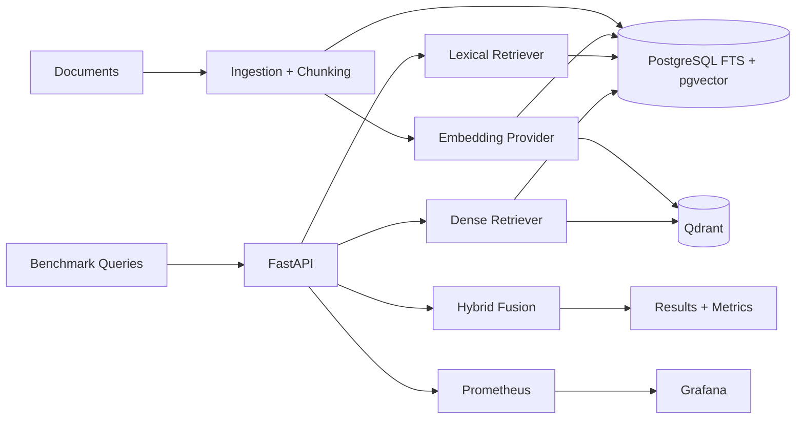

# rag-retrieval-benchmark

`rag-retrieval-benchmark` is a reproducible engineering benchmark for comparing RAG retrieval strategies across quality, latency, filtering behavior, indexing cost, storage, concurrency, and observability.

This repository is intentionally not a RAG chatbot. It measures retrieval systems under shared data, shared chunks, shared embeddings, shared filters, and shared benchmark queries.

## Architecture



## Quick Start

```bash
make install
make up
make migrate
make seed
make benchmark-small
```

If Docker daemon access fails, fix local Docker socket permissions or run from a Docker-enabled session. In this environment the Docker CLI is installed, but `/var/run/docker.sock` is not accessible to the current user.

## Design Decisions

- Python runtime is pinned to `>=3.12,<3.13`. The API Docker image uses Python 3.12 for reproducibility.
- Local commands use `UV_CACHE_DIR=/tmp/uv-cache` because the default uv cache may be read-only in constrained environments.
- The default embedding provider is local Sentence Transformers. External embedding APIs are optional and are not used by default benchmark runs.
- Benchmark quality claims require relevance labels. Automatically generated labels and human-checked labels are stored separately.
- 10K, 100K, and 1M local benchmarks are useful engineering comparisons, but they are not equivalent to internet-company billion-scale production systems.
- Results are valid only for the declared hardware, configuration, model, dataset, cache mode, and concurrency level.

## Roadmap

- Phase 1: scaffold infrastructure and health endpoints.
- Phase 2: schema, ingestion, chunking, embeddings, PostgreSQL and Qdrant indexing.
- Phase 3: lexical, dense, Qdrant, and hybrid retrieval.
- Phase 4: benchmark metrics and result artifacts.
- Phase 5: load testing and mixed workloads.
- Phase 6: Prometheus and Grafana dashboards.
- Phase 7: adaptive retrieval routing.
- Phase 8: complete methodology, trade-off analysis, and reproducibility docs.

## Adaptive Query Router

The optional adaptive router is rule based in v1 and intentionally isolated from retriever implementations. It sends identifier-heavy queries such as error codes, versions, function names, paths, and UUIDs toward lexical retrieval; semantic natural-language questions toward dense retrieval; and mixed identifier plus intent queries toward hybrid retrieval. This keeps the baseline replaceable by a learned classifier later.
