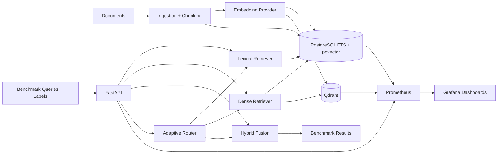

# rag-retrieval-benchmark

`rag-retrieval-benchmark` is an open, reproducible benchmark for comparing retrieval strategies used in RAG systems. The project focuses on retrieval quality, database/index performance, filtering, online writes, tail latency, observability, and engineering trade-offs.

It is not a chatbot demo. The goal is to make retrieval behavior measurable under shared data, shared chunks, shared embeddings, shared query sets, shared metadata, and shared benchmark settings.

## Motivation

RAG retrieval choices are usually discussed as if the only question were "which vector database is faster?" That is too narrow. Real systems need exact identifier lookup, semantic paraphrase recall, metadata isolation, predictable tail latency, online update visibility, operational metrics, and understandable failure modes.

This benchmark compares:

- PostgreSQL Full-Text Search with `tsvector`, `websearch_to_tsquery`, GIN indexes, ranking, and SQL metadata filters.
- PostgreSQL + pgvector with cosine similarity and HNSW indexes.
- Qdrant with the same embeddings, chunks, metadata, `top_k`, and payload filters.
- Hybrid retrieval with Reciprocal Rank Fusion and weighted score fusion.
- Optional adaptive routing between lexical, dense, and hybrid retrieval.

## Architecture



## Retrieval Pipeline

1. Documents are chunked with a shared chunk size and overlap.
2. Every retriever sees the same chunk text, metadata, query set, labels, and `top_k`.
3. Dense backends use the same embedding provider and stored vectors.
4. Metadata filters are applied through SQL filters for PostgreSQL and payload filters for Qdrant.
5. Hybrid retrieval runs lexical and dense retrieval, then fuses candidates with RRF or normalized weighted score fusion.
6. Benchmarks compute retrieval quality from relevance labels before any optional generation layer.

## Tech Stack

- Python `>=3.12,<3.13`
- FastAPI, Pydantic v2
- SQLAlchemy 2.x, asyncpg, Alembic
- PostgreSQL 16 + pgvector
- Qdrant
- Sentence Transformers local embeddings, optional external embedding API
- Docker Compose
- Prometheus, Grafana, postgres exporter, node exporter
- Locust
- pytest, Ruff, mypy, pre-commit, GitHub Actions

## Quick Start

```bash
make install
make up
make migrate
make seed
make benchmark-small
```

The API runs on `http://localhost:8000`, Prometheus on `http://localhost:9090`, and Grafana on `http://localhost:3000` with the local demo credentials from `docker-compose.yml`.

If Docker daemon access fails, fix local Docker socket permissions or run from a Docker-enabled session. On the current implementation host, `docker info` fails because the user cannot access `/var/run/docker.sock`.

## API

- `GET /health`
- `GET /ready`
- `GET /metrics`
- `POST /search`
- `POST /benchmark/run`
- `GET /benchmark/runs`
- `GET /benchmark/runs/{run_id}`
- `POST /documents`
- `PATCH /documents/{document_id}`
- `DELETE /documents/{document_id}`

`POST /search` accepts `query`, `strategy`, `top_k`, `filters`, `dense_backend`, `fusion_method`, `reranker_enabled`, and `debug`.

## Dataset

The seed pipeline starts with deterministic synthetic technical documents so the benchmark can run locally and in CI. Dataset configs support 10K, 100K, and 1M chunk targets. The generator varies topic, tenant, language, department, version, access level, identifiers, and error codes instead of duplicating the same text.

Query types include exact identifier, error code, API/function name, semantic paraphrase, conceptual question, mixed lexical-semantic query, version-specific query, metadata-filtered query, multilingual query, and hard negative query.

Relevance labels are stored with a `label_source` field. Automatically generated labels are not presented as human-verified labels.

## Fairness Rules

All retrieval strategies must share the same raw documents, chunking, embedding model, embeddings, query set, metadata, `top_k`, warm-up policy, concurrency level, resource limits, and cache mode. Qdrant and pgvector must never be compared with different embeddings.

Weighted hybrid fusion min-max normalizes lexical ranking scores and cosine scores before combining them. RRF uses rank positions and avoids comparing incompatible raw score scales.

## Metrics

Retrieval quality:

- Recall@K
- Precision@K
- Hit Rate@K
- MRR
- NDCG@K

Latency and throughput:

- mean, max, P50, P90, P95, P99
- QPS and sustained throughput
- timeout rate and error rate
- separate timing for embedding, lexical retrieval, vector retrieval, fusion, reranking, and total retrieval

Indexing and storage:

- import time, embedding time, index build time, index size, database size
- write throughput, update latency, delete latency
- write-to-search visibility latency

## Benchmark Method

Benchmark configs are YAML files under `benchmarks/configs/`. Each run stores JSON, CSV, Markdown summary, and charts under `benchmarks/results/<run_id>/`.

Load testing uses Locust with:

- concurrency: 1, 5, 10, 25, 50, 100
- read-only: 100 percent search
- mostly-read: 95 percent search, 5 percent insert/update
- mixed: 80 percent search, 10 percent insert, 5 percent update, 5 percent delete
- fixed random seed
- warm-up plus fixed measurement window
- cold and warm cache modes

## Observability

Prometheus collects API request counts, latency histograms, errors, active requests, retrieval strategy counts, stage latency, result counts, empty result counts, and filter selectivity. Labels intentionally avoid query text, document IDs, chunk IDs, and other high-cardinality values.

Grafana dashboards are committed as JSON:

- System Overview
- Retrieval Comparison
- PostgreSQL Performance
- Qdrant Performance
- Load Test Overview
- Benchmark Quality Metrics

## Failure Cases To Inspect

- Exact identifiers may favor lexical retrieval over dense retrieval.
- Semantic paraphrases may favor dense retrieval over FTS.
- Version-specific queries can fail if tokenization or metadata filters are wrong.
- Metadata-filtered queries can return fewer than `top_k` results under selective filters.
- Hard negatives should return empty or low-confidence results, not arbitrary confident answers.
- Multilingual queries depend heavily on the embedding model.

## Trade-Off Summary

- PostgreSQL FTS is simple, explainable, and strong for identifiers, error codes, function names, and exact terms.
- pgvector reduces infrastructure count when PostgreSQL is already the system of record, but ANN index behavior competes with normal database workload.
- Qdrant adds a dedicated vector-serving component with purpose-built ANN operations and payload filtering, at the cost of data synchronization and operational complexity.
- Hybrid retrieval usually improves robustness, but it adds latency, score normalization concerns, and more moving parts.
- Adaptive routing can approach hybrid quality on mixed traffic while reducing average latency, but rule-based routing needs continuous validation against query drift.

## Reproducibility

Before publishing results, record:

- Git commit hash
- YAML config
- embedding model, dimension, batch size, and device
- dataset size and seed
- hardware information
- cache mode and warm-up duration
- concurrency and measurement window
- whether reranking or generation was enabled

Run the pre-push checks:

```bash
git status
git diff --check
ruff check .
ruff format --check .
mypy app
PYTEST_DISABLE_PLUGIN_AUTOLOAD=1 pytest
docker compose config
```

## Known Limits

- Local 10K, 100K, and 1M benchmarks are not equivalent to billion-scale production retrieval.
- Results are valid only for the declared hardware, model, data, filters, cache mode, and concurrency.
- Synthetic data differs from production traffic and should be replaced or supplemented with real domain corpora before making product decisions.
- Embedding model choice can dominate multilingual and semantic-query results.
- Latency, quality, storage, update behavior, and infrastructure complexity must be compared together.
- On this host, Docker daemon access is blocked, so Compose E2E validation has not run here yet.

## Roadmap

- Add human-reviewed relevance labels for a public technical corpus.
- Add optional reranker and generation-layer evaluation after retrieval baselines stabilize.
- Add PostgreSQL `EXPLAIN (ANALYZE, BUFFERS, FORMAT JSON)` artifact capture for representative filter queries.
- Add larger benchmark result reports for 100K and 1M chunks on declared hardware.
- Replace or augment the rule-based adaptive router with a trained classifier.
